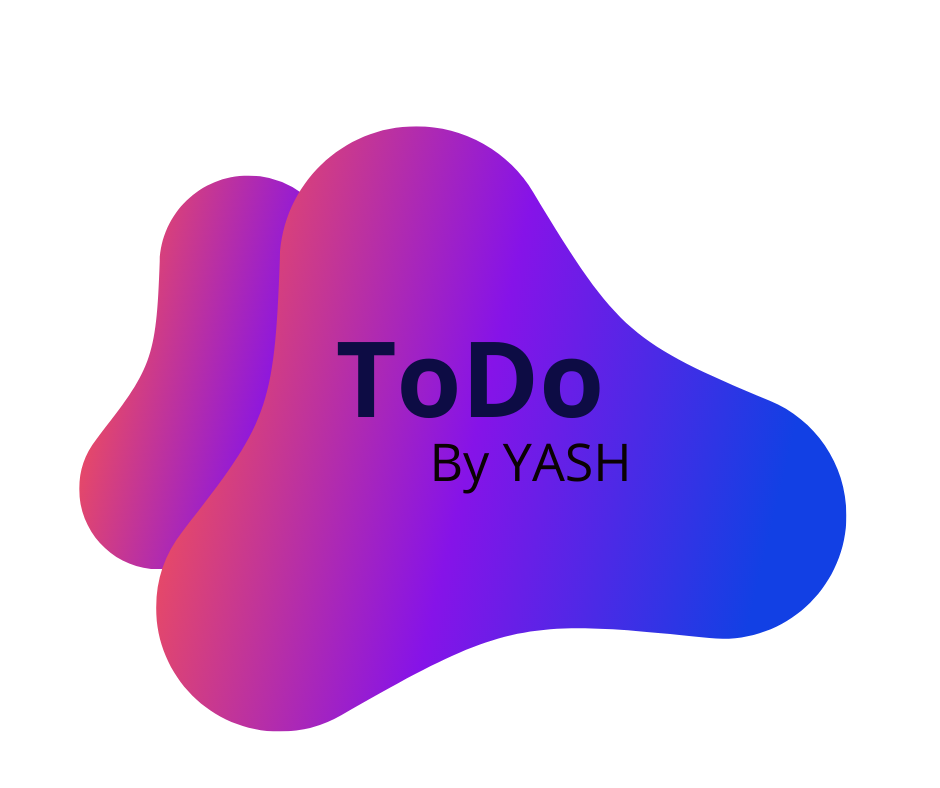

1.
    # ToDo-ME
    ## _The ToDo List App_
    
    
    
     ToDo Me is a flutter app that can be used to set task and todo. It is not dependent on network so that you can set tasks and todos on your device anytime and  anywhere. 
     It also reminds uesr of tasks he missed and hence provides easy and efficient management of time and schedule.

    
    Here are the key features in detail:
    
    ⭐ Set daily tasks
    
    ⭐ Set ToDo lists
    
    ⭐ Simple Minimalist UI
    
    ⭐ Easy to Use
    
    ## Tech
    
    
    
    
    ## Plugins
    - cupertino_icons: ^0.1.3
    - google_fonts: ^1.1.0
    
	## Getting Started
    
    This project is a starting point for a Flutter application.
    
    A few resources to get you started if this is your first Flutter project:
    
    - [Lab: Write your first Flutter app](https://flutter.dev/docs/get-started/codelab)
    - [Cookbook: Useful Flutter samples](https://flutter.dev/docs/cookbook)
    
    For help getting started with Flutter, view our
    [online documentation](https://flutter.dev/docs), which offers tutorials,
    samples, guidance on mobile development, and a full API reference.
    
    ### Screenshots 📱
    
	
	
	
    ```
